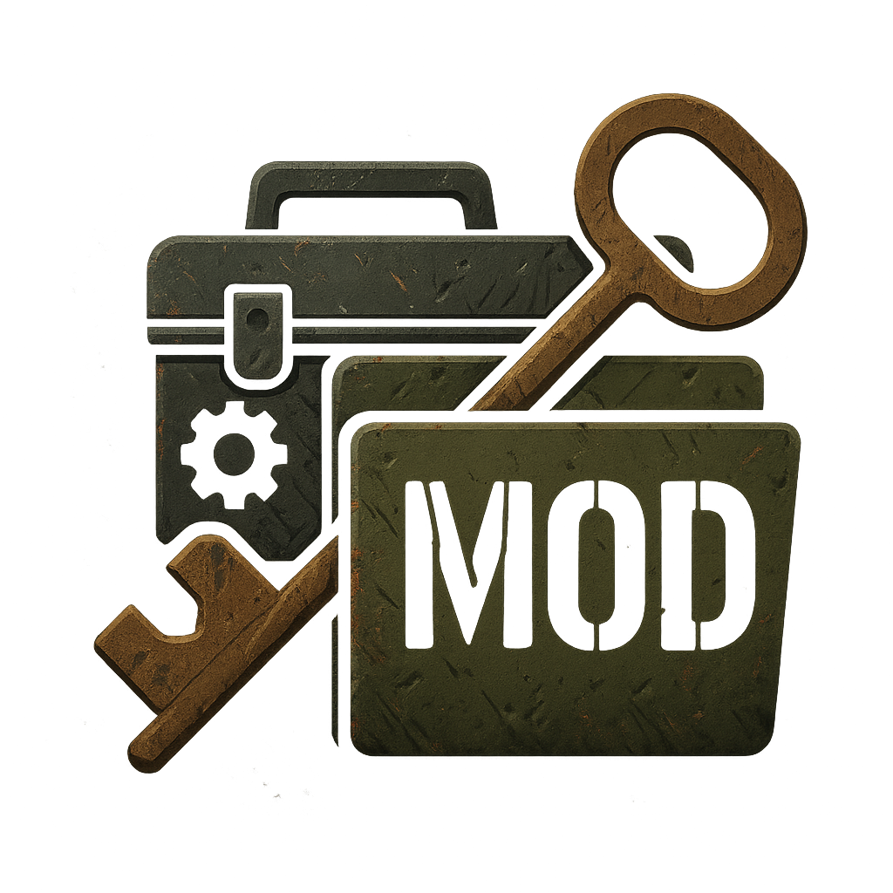

# 🎮 DayZModInstaller

一个专为 DayZ 本地服务器设计的简易 GUI 工具，右侧栏 Release 点击下载

用于快速批量同步 Steam 创意工坊已订阅的 MOD 到你的服务器，  

并自动处理 `.bikey` 签名文件、依赖顺序等琐碎操作，提升 Mod 管理效率。

---

## 🚀 功能特点

✅ **一键选择 DayZ Server 目录** 和 Steam 创意工坊订阅目录  
✅ **拖拽安装单个 Mod** 到服务器，并自动：
   - 复制 Mod 文件夹
   - 递归扫描 `.bikey` 文件（不管作者是否命名为 `keys`）
   - 合并到服务器 `keys/` 文件夹  
   - 更新启动脚本 `ServerStart.bat` 的 `-mod=` 行  
✅ **批量对比已订阅 Mod 与服务器已有 Mod**
   - 自动高亮未同步的 Mod  
   - 点击【同步】可批量复制缺失 Mod 并自动处理 keys 和依赖  
✅ **可视化拖拽调整 Mod 加载顺序**
   - 在同步页面可直接上下拖动 `-mod=` 列表  
   - 点击【保存顺序】实时更新 `ServerStart.bat`  
✅ **安全删除 Mod**
   - 可选中单个 Mod 从服务器目录删除  
   - 自动匹配并删除对应的 `.bikey` 文件，防止残留签名  
   - DayZ 订阅目录不受影响，需在 Steam 中手动取消订阅  
✅ **多线程文件复制**
   - 同步过程不卡 UI，支持大体积 Mod 批量处理  
✅ **内置日志输出**
   - 操作过程一目了然  
✅ **支持多语言切换（示例中已含中英文）**

---

# 🎮 DayZModInstaller

A simple GUI tool for DayZ local server players to quickly install and manage Steam Workshop mods on their server.  
It helps you automate mod file copying, `.bikey` key handling, and `ServerStart.bat` updates — all with a user-friendly interface.

---

## 🚀 Features

✅ **Drag-and-drop single mod installation**
   - Copy mod folder to your DayZ server directory
   - Recursively scan for `.bikey` files (no matter what folder name the author uses)
   - Merge `.bikey` files into your server's `keys/` folder
   - Update your `ServerStart.bat` `-mod=` line automatically

✅ **Batch sync subscribed mods**
   - Compare your subscribed mods folder vs. your server mods folder
   - Highlight missing mods in red
   - One click to sync all missing mods, including keys and script updates

✅ **Visual mod load order management**
   - Display current `-mod=` load order as a drag-and-drop list
   - Rearrange mod order by dragging
   - Save your custom order to `ServerStart.bat` with one click

✅ **Safe mod removal**
   - Select a mod from the list to remove it from the server
   - Automatically delete corresponding `.bikey` files in `keys/` to prevent leftover signatures
   - Does **not** affect your Steam subscriptions — unsubscribe manually in Workshop

✅ **Multi-threaded file operations**
   - Keeps UI responsive even when copying large mods

✅ **Built-in logging**
   - Shows every step in real time

✅ **Language support**
   - Includes English and Chinese switching

---

## 📄 License

This project is licensed under the Creative Commons Attribution-NonCommercial 4.0 International License (CC BY-NC 4.0).

- You are free to use, copy, modify, and share this project for personal, educational, and non-commercial purposes.
- Commercial use, including selling, redistributing for profit, or bundling into paid software, is strictly prohibited without explicit permission from the author.

For details, see the [LICENSE](./LICENSE) file or visit [CC BY-NC 4.0](https://creativecommons.org/licenses/by-nc/4.0/).
